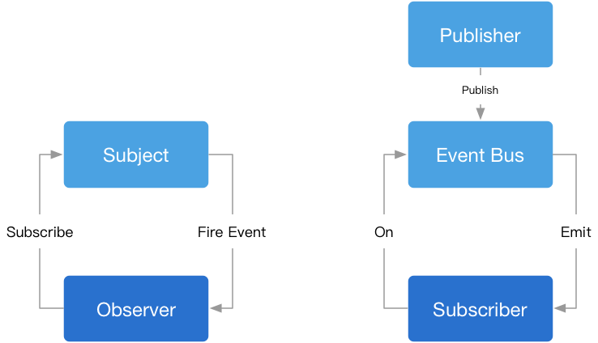

# 发布-订阅模式

发布-订阅模式又叫观察者模式，它定义对象间的一种一对多的依赖关系，当一个对象的状态发生改变时，所有依赖于它的对象都将得到通知。

发布-订阅模式优点：1、时间上解耦，2、对象之间解耦。
发布-订阅模式适用场景：异步编程，代码松耦合。

发布-订阅模式缺点：1、订阅消息未发生导致浪费内存，2、过度使用导致程序难以追踪维护和理解。

## 发布-订阅模式例子

发布-订阅模式核心明确谁来当发布者，订阅者和缓存列表。

```
const salesoffices = { // 定义售楼处

	clientList: [], // 定义缓存列表，存放订阅者的回调函数

	listen: function(fn) { // 增加订阅者
		this.clientList.push(fn);  // 订阅的消息添加进缓存列表
	},

	trigger: function() {  // 发布消息
		for(let i =0; i < this.clientList.length; i++) {
			let fn = this.clientList[i]; 
			fn.apply(this,arguments);  // arguments 是发布消息时带上的参数
		}
	}
};

salesoffices.listen(function(price,squareMeter){
	console.log("价格：" + price);
	console.log("squareMeter："+ squareMeter);
});

salesoffices.listen(function(price,squareMeter){
	console.log("价格：" + price);
	console.log("squareMeter："+ squareMeter);
});

salesoffices.trigger(20000,89);
salesoffices.trigger(30000,110);
```

改进订阅者只订阅自己感兴趣的事件

```
const salesoffices = {

	clientList: {}, 

	listen: function(key,fn) {
		if (!this.clientList[key]) {
			this.clientList[key] = [];
		}
		this.clientList[key].push(fn);
	},

	trigger: function() {
		const key = Array.prototype.shift.call(arguments);
		const fns = this.clientList[key];

		if (!fns || fns.length === 0) {
			return false;
		}

		for(let i=0,length=fns.length;i<length;i++) {
			let fn = fns[i];
			fn.apply(this,arguments);
		}
	},
	
	remove: function(key, fn) {
		const fns = this.clientList[key];

		if (!fns) { // 如果key对应的消息没有被人订阅，则直接返回
			return false;
		}

		if (!fn) { // 如果没有传入具体的回调函数，表示需要取消key对应消息的所有订阅
			fns && (fns.length = 0);
		} else {
			for (let i= fns.length -1;i >=0;i--) { // 反向遍历订阅的回调函数列表
				let _fn = fns[i];
				if ( _fn === fn) {
					fns.splice(i ,1);  // 删除订阅者的回调函数
				}
			}
		}
	}
};

salesoffices.listen("squareMeter89", function(price) {
	console.log("价格：" + price);
});                                              
salesoffices.listen("squareMeter110", function(price) {
	console.log("价格：" + price);
});

salesoffices.trigger("squareMeter89",20000);
salesoffices.trigger("squareMeter110",30000);
```

## 模块间通信

发布-订阅模式可用于模块间通信。

```
<!DOCTYPE html>
<html>

<body> 
    <button id="count">点我</button>
    <div id="show"></div>
</body>
<script type="text/javascript">
    var a = (function(){
        var count = 0;
        var button = document.getElementById("count");
        button.onClick = function() {
            Event.trigger("add",count++);
        }
    })();
    var b = (function(){
        var div = document.getElementById("show");
        Event.listen("add",function(count) {
            div.innerHTML = "count";
        });
    })();
</script>
</html>
```

例如，上面两个模块，a模块里面的按钮，每次点击按钮之后，b模块里的div中会显示按钮的总点击次数。a，b模块相互独立，但是可以通过全局发布-订阅模式进行通信。




## 参考

- [观察者模式VS订阅发布模式](https://molunerfinn.com/observer-vs-pubsub-pattern/#%E6%A6%82%E8%BF%B0)

