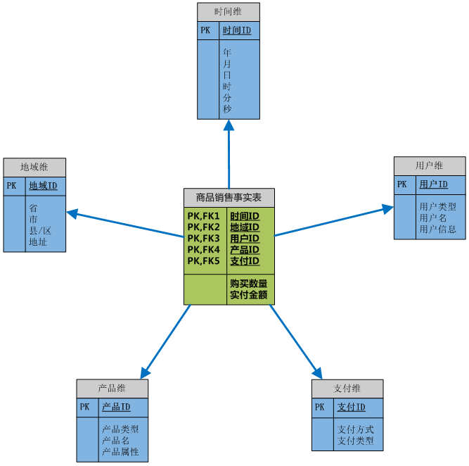

# 数据仓库的多维数据模型

## 多维数据模型的定义和作用

多维数据模型是为了满足用户从多角度多层次进行数据查询和分析的需要而建立起来的基于事实和维的数据库模型，其基本的应用是为了实现OLAP（Online Analytical Processing）。

当然，通过多维数据模型的数据展示、查询和获取就是其作用的展现，但其真的作用的实现在于，通过数据仓库可以根据不同的数据需求建立起各类多维模型，并组成**数据集市**开放给不同的用户群体使用，也就是根据需求定制的各类数据商品摆放在数据集市中供不同的数据消费者进行采购。

## 多维数据模型实例

### 事实表

### 维表

### 星形模型 (star schema)

### 雪花模型（snowflake schema）

### 事实星座模型 (fact constellation) 或 星系模型 (galaxy schema)

## 多维数据模型的优缺点

### 优点

**多维数据模型最大的优点就是其基于分析优化的数据组织和存储模式。**举个简单的例子，电子商务网站的操作数据库中记录的可能是某个时间点，某个用户购买了某个商品，并寄送到某个具体的地址的这种记录的集合，于是我们无法马上获取2010年的7月份到底有多少用户购买了商品，或者2010年的7月份有多少的浙江省用户购买了商品？但是在基于多维模型的基础上，此类查询就变得简单了，只要在时间维上将数据聚合到2010年的7月份，同时在地域维上将数据聚合到浙江省的粒度就可以实现，这个就是OLAP的概念，之后会有相关的文章进行介绍。

### 缺点

**多维模型的缺点就是与关系模型相比其灵活性不够，一旦模型构建就很难进行更改。**比如一个订单的事实，其中用户可能购买了多种商品，包括了时间、用户维和商品数量、总价等度量，对于关系模型而言如果我们进而需要区分订单中包含了哪些商品，我们只需要另外再建一张表记录订单号和商品的对应关系即可，但在多维模型里面一旦事实表构建起来后，我们无法将事实表中的一条订单记录再进行拆分，于是无法建立以一个新的维度——产品维，只能另外再建个以产品为主题的事实表。

　　所以，在建立多维模型之前，我们一般会根据需求首先详细的设计模型，应该包含哪些维和度量，应该让数据保持在哪个粒度上才能满足用户的分析需求。

　　这里对数据仓库的多维模型进行了简单的介绍，你是不是想到了其实你在分析数据的时候很多的数据就是复合多维模型的结构的，或者你已经用自己的方法构建出了多维模型或者实现的数据的多维化展示，欢迎与我分享。

## 参考

- [数据仓库的多维数据模型](http://webdataanalysis.net/web-data-warehouse/multidimensional-data-model/)
- [多维数据模型的设计](https://blog.csdn.net/yukaiqweR/article/details/78443853)