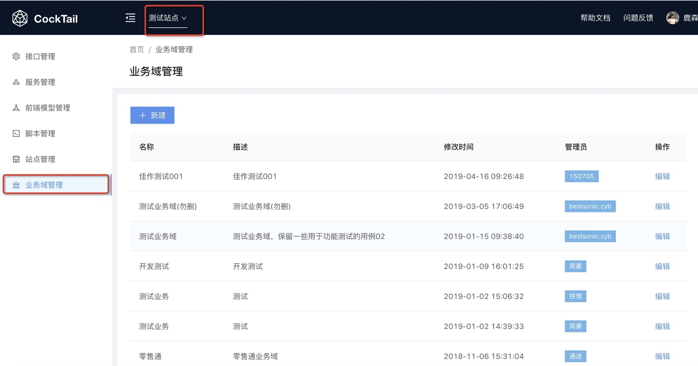
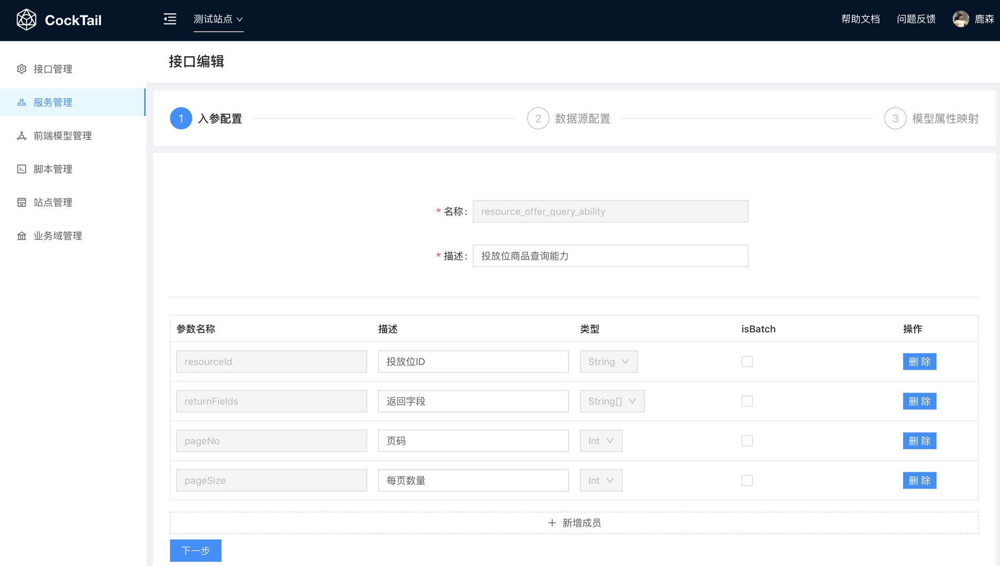

# Cocktail 体验升级了

## 清理

### 业务域管理员权限

本次我们清理了无效的业务域，现在的业务域不能开放给大家公开注册了，有需要可以联系管理员（@鹿森 / @通途）进行添加，这也是为了平台的易用性考虑。一堆莫名其妙的业务域让相大家选择，相信大家也会觉得非常头痛。

### 更简洁的站点选择

因为历史原因，大家在平台上建立非常多的测试站点，导致真正使用者都难以寻找到自己的站点应用。本次我们进行了清理，留下目前在正在使用的站点。测试站点用于给体验平台的人员使用，也希望大家在测试上多多体验。另外一个是1688 目前在使用的业务域，这里希望有真正的业务需求的小伙伴能在这上面建立自己的站点。

## 流畅

### 更大的交互空间

本次更新我们将左侧导航缩小了，预留了右侧更大的交互空间。并且大家也发现顶部导航的颜色和左侧导航的颜色都有相对应的调整。这样的调整其实比较符合用户设计，区分导航区和操作区。

### 友好的脚本映射

服务中心模型属性映射上以弹框的方式新增/修改映射脚本。这样容易把背后的模型属性，数据来源，映射自定义脚本挡住，导致用户在认知流程上比较割裂。这次升级我们进行了改版，映射的脚本从右边进入，使书写脚本过程更加流畅。

### 线上版本的迁移在日程中

原来我们的服务端应用都是在日常环境的，静态资源也都是发布在日常环境。因为日常环境不稳定性导致有时候页面资源无法加载，而出现网站崩溃的情况。本次我们也着重为了用户体验考虑，将迁移到线上环境，迁移已经在日程中，不出几日，就能体验到更好的平台性能了。

