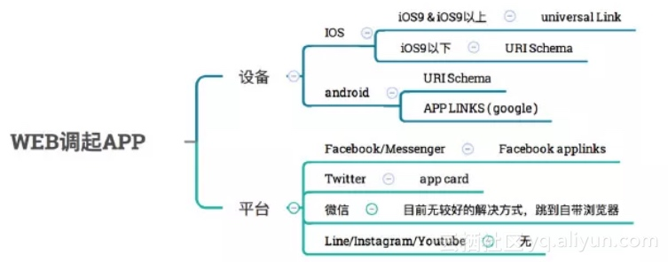
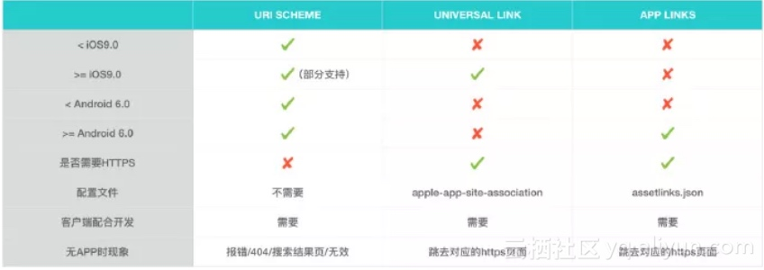

# H5 唤起 APP 指南

## 兼容性

|  | URI Scheme | Universal Link | App Links |
| --- | --- | --- | --- |
| <ios9 |  |  |  |
| >=ios9 |  |  |  |
| <Android 6.0 |  |  |  |
| >=Android 6.0 |  |  |  |
| 是否需要HTTPS |  |  |  |
| 配置文件 |  |  |  |
| 客户端配合开发 |  |  |  |
| 无APP时现象 |  |  |  |

## 参考

- [H5 唤起 APP 指南](https://github.com/suanmei/callapp-lib/issues/1)
- [h5调起app、调用端能力、应用商店下载](https://github.com/jawidx/web-launch-app)
- [从前端的角度出发 – web 调起 APP](https://yq.aliyun.com/articles/637678?spm=a2c4e.11153940.0.0.4f9d2e4fkt4BbB)
- [MobLink 市面产品](http://www.mob.com/mobService/moblink)

