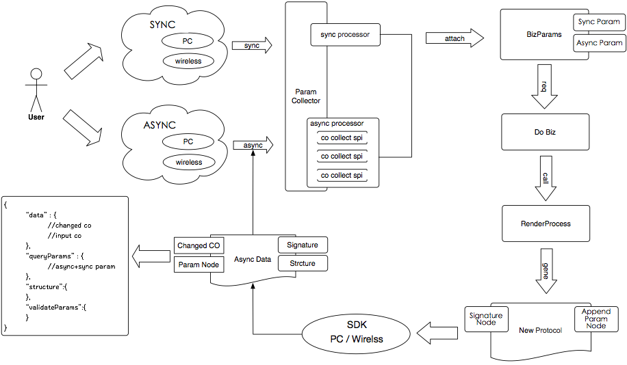

# 云端一体化 - 奥创 

过程度量，数据结果

针对交易业务
高效，高隔离，高复用

- 前端业务组件承载了过多的逻辑
- 多端所依赖的数据格式不一样，导致多端需要开发多个接口数据格式

## 组件化协议 - 解决方案

与前端约定数据规范。

- 统一各个端的差异，将前端复杂的逻辑后移，前端侧只作为渲染层。
- 前后端数据传输标准，数据返回标准。

MVVM + 区块化（高内聚，相互隔离） + 统一通信协议（同步 and 异步） + 前端SDK

### 前端 SDK 

将后端的协议数据进行解析，封装协议处理，数据回收，事件触发的二方库。

### 节奏

1、首先确定 schema 数据协议
2、快速产生这份协议数据

