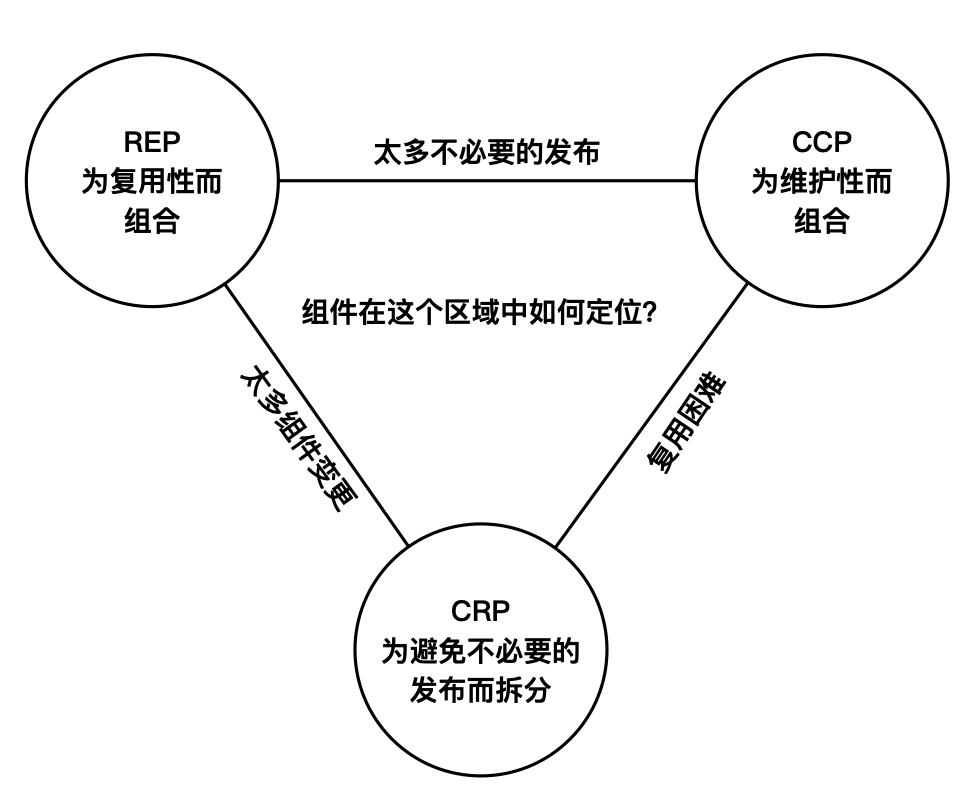

# 架构整洁之道（一）

架构的价值，例：随着版本迭代，工程师团队的规模持续增长，但总代码行数却趋于稳定，相对应的，每行代码的变更成本升高、工程师的生产效率降低。

## 架构工作目标

用最少的人力成本满足构建和维护该系统的需求。
在整个系统的生命周期中，
- 开发阶段：组件不要使用大量复杂的脚手架；不同团队负责不同的组件，避免不必要的协作
- 部署阶段：减少部署的繁重工作。
- 运行阶段：架构设计要考虑到不同的吞吐量、不同的响应时长要求；架构应起到揭示系统运行的作用：用例、功能、行为设置应该都是对开发者可见的一级实体，以类、函数或模块的形式占据明显位置，命名能清晰地描述对应的功能。
- 维护阶段：减少探秘成本和风险。

## 编程范式

结构化编程（1968年）：限制了控制权的直接转移。
面向对象编程（1966年）：限制了控制权的间接转移。
函数式编程（1936年）：限制了赋值。

### 1、结构化编程

结构化编程证明了人们可以用**顺序结构、分支结构、循环结构**这三种结构构造出任何程序，并限制了 goto 的使用。

### 2、面向对象编程

面向对象编程包括**封装，继承，多态**。多态让我们更方便、安全地通过函数调用的方式进行**组件间通信**，它也是依赖反转（让依赖与控制流方向相反）的基础。

### 3、函数式编程

函数式编程有很多种定义很多种特性，架构角度看它的**没有副作用，不修改状态**。

在架构领域所有的**竞争问题、死锁问题、并发问题**都是由可变变量导致的。

综上：没有结构化编程，程序就无法从一块块可证伪的逻辑搭建，没有面向对象编程，跨越组件边界会是一个非常麻烦而危险的过程，而函数式编程，让组件更加高效而稳定。没有编程范式，架构设计将无从谈起

## 设计原则（11原则）

### 1、OCP（开闭原则）

易于扩展，同时抗拒修改。对扩展开放，对修改关闭。

	架构设计的主导原则，其他的原则都为这条原则服务。

### 2、SRP（单一职责原则）

任何一个软件模块，都应该只有一个被修改的原因。
	
	这个原则是知道我们如何拆分组件的。

### 3、LSP（里氏替换原则）

当用同一接口的不同实现互相替换时，系统的行为应该保持不变。
	
	这个原则是指导接口和其实现方式的。

### 4、ISP（接口隔离原则）

不依赖任何不需要的方法、类或组件。

	这个原则指导我们的接口设计。
	
### 5、DIP（依赖反转原则）

跨越组建边界的依赖方向永远与控制流的方向相反。

	该原则指导我们设计组件间依赖的方向。
	
### 6、REP（复用、发布等同原则）

软件复用的最小粒度应等同于其发布的最小粒度。直白地说，就是要复用一段代码就把它抽成组件。

	该原则指导我们组件拆分的粒度。

### 7、CCP（共同闭包原则）

为了相同目的而同时修改的类，应该放在同一个组件中。CCP原则是SRP原则在组件层面的描述。

	该原则指导我们组件拆分的粒度。
	
### 8、CRP（共同复用原则）

不要强迫一个组件依赖它不需要的东西。CRP原则是ISP原则在组件层面的描述。
	
	该原则指导我们组件拆分的粒度。

### 9、无依赖环原则

健康的依赖应该是个有向无环图（DAG），互相依赖的组件，实际上组成了一个大组件，这些组件要一起发布、一起做单元测试。我们可以通过依赖反转原则 DIP 来解除依赖环。

### 10、稳定依赖原则

依赖必须要指向更稳定的方向。

### 11、稳定抽象原则

一个组件的抽象化程度应该与其稳定性保持一致。

	组件抽象化程度的定量化描述是：抽象程度（A）= 组件中抽象类和接口的数量 / 组件中类的数量。

## 架构工作方针

`尽可能长时间地保留尽可能多的可选项` 这里的可选项指的是无关紧要的细节设计，比如具体选用哪个存储方式、哪种数据库，或者采用哪种 Web 框架。业务代码要和这些可选项解耦，数据库或者框架应该做到像插件一样切换，业务层对这个切换的过程应该做到完全无感。

`低层次解耦方式能解决的` 不要用高层次解耦方式。组件之间的解耦方式后边细讲，这里强调的是边界处理越完善，开发和部署成本越高。所以不完全边界能解决的，不要用完全边界，低层次解耦能解决的，不要用高层次解耦。

### 1、组件拆分

组件的定义：组件是一组描述如何将输入转化为输出的策略语句的集合，在同一个组件中，策略的变更原因、时间、层次相同。

组件拆分需要在两个维度进行：**按层次拆分、按变更原因拆分**

### 2、组件依赖

依赖关系与数据流控制流脱钩，而与组件所在层次挂钩，始终从低层次指向高层次。

### 3、组件边界

首先跨越组件边界进行通信的两个类都要抽象为接口，另外需要声明专用的输入数据模型、声明专用的返回数据模型，想一想每次进行通信时都要进行的数据模型转换，就能理解维护一个组件边界的成本有多高。

**不完全边界**

- 省掉最后一步：声明好接口，做好分割后，仍然放在一个组件中，等到时机成熟时再拆出来独立编译部署。
- 单向边界：正常的边际至少有两个接口，分别抽象调用方和被调用方。这里只定义一个接口，高层次组件用接口调用低层次组件，而低层次组件直接引用高层次组件的类。
- 门户模式：控制权的间接转移不用接口和实现去做，而是用门户类去做，用这种方式连接口都不用声明了。

**边界解耦方式**

- 源码层次：做了接口、类依赖上的解耦，但是放在同一个组件中，通常放在不同的路径下。和不完全边界的省略最后一步一样。
- 部署层次：拆分为可以独立部署的不同组件，比如 iOS的静态库、动态库，真正运行时处于同一台物理机器上，组件之间通常通过函数调用通讯。
- 服务层次：运行在不同的机器上，通过url、网络数据包等方式进行通讯。